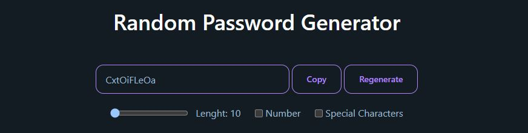

### Password Generator

This is a simple password generator application built with React, Vite, Tailwind CSS, and DaisyUI. It allows users to generate passwords based on their preferences, including the option to include numbers and special characters.



#### Installation

To run this application locally, follow these steps:

1. Install dependencies:

   ```
   npm install
   ```

2. Start the development server:

   ```
   npm run dev
   ```

   This will start the development server and open the application in your default web browser.

#### Usage

Once the application is running, you'll be presented with a simple UI for generating passwords. You'll see options to include numbers and special characters in the generated password.

1. Toggle the "Include Numbers" checkbox if you want numbers to be included in the generated password.
2. Toggle the "Include Special Characters" checkbox if you want special characters to be included in the generated password.
3. Adjust the length of the password using the range input.
4. Click the "Regenerate" button to regenerate a password based on your preferences.
5. Copy the generated password to your clipboard using the "Copy" button.

#### Technologies Used

- **React**: Used for building the user interface and managing state.
- **Vite**: Used as a build tool for development and bundling.
- **Tailwind CSS**: Used for styling the application's UI.
- **DaisyUI**: Used in conjunction with Tailwind CSS for additional UI components.

#### Hooks Used

- **useEffect**: Used for handling side effects such as updating the password when preferences change.
- **useState**: Used for managing the state of the application, including password generation settings.
- **useRef**: Used for accessing DOM elements, particularly for copying the generated password.
- **useCallback**: Used for memoizing functions to prevent unnecessary re-renders.

#### Acknowledgments

This project was created following the guidance of tutorials and documentation for React, Vite, Tailwind CSS, and DaisyUI. Special thanks to the developers and contributors of these technologies for their hard work and dedication.

---
